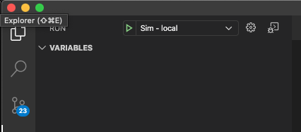
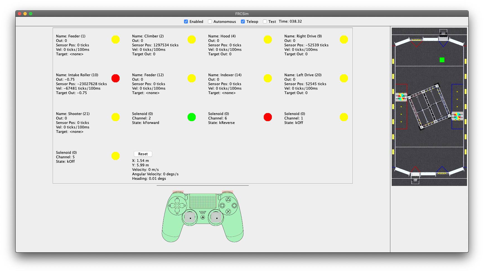

# InfiniteRecharge2020

## cpostbitbuckets additions
* Added support for FRCSim

After building your robot with Build Robot Code from build.gradle, select the Sim - local launch configuration from the debug menu.

Then just press `F5` to run it. You should see this fancy interface.

* Keys `wasd`, `ijkl`, and `<>` operate the axis on the joystick. 
* Keys `1-0` and `-=` press a joystick button
* The arrow keys press dpad buttons
* Hold `shift` or press `space` to switch to joystick 2

Various motor physics settings live in [FRCSim/config.yaml](FRCSim/config.yaml)

